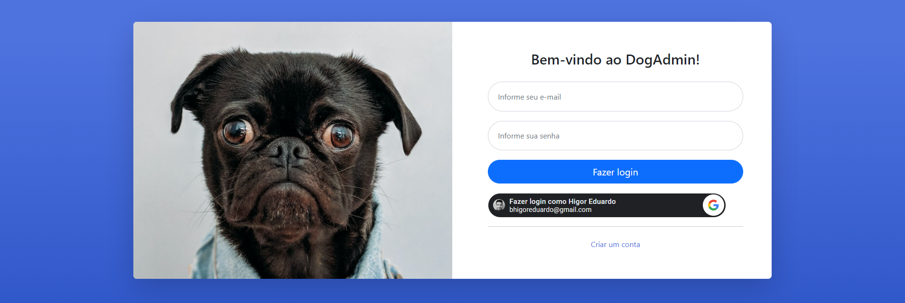

<h1 align="center">
  💻 App Node.js/Vue.js
</h1>

✅ Back com Node.js (RESTApi)
✅ Front Vue.js
✅ Banco noSQL (MongoDB)
✅ Design Responsivo

## 🔥 Rodar Aplicação:
- Vue.js (porta 8080): `npm run serve`
- Node.js (porta 3000): `npm start`
- MongoDB (porta 27017): `mongod`

## ✨ Objetivo
- Aplicação WEB em Node.js/Vue.js simples com interação MongoDB
- Fazer o controle de versão de de uma forma clara e explicativa nos commits
- Cadastro de usuário através do Facebook ou Google
- Login
- Exibir dados do usuário logado provenientes do Facebook ou Google
- Exibir listagem de usuários cadastrados
- Utilizar pelo menos 2 funções da API: `https://swapi.dev/`
- Criar navegação até chegar ao fim do fluxo das chamadas da API

## 🤪 Modelagem do Usuário:
- nome: String
- sobrenome: String
- email: String
- senha: String
- googleId: String

## 😬 Instalações necessárias:
- Git (Teste): `git -v`
- Node.js (Teste): `node -v` e `npm -v`
- VS Code
- Postman
- Vue CLI: `npm install -g @vue/cli` (Teste): `vue --version`

## 🎯 Requisições:
- Node.js/Vue.js com MongoDB
	- [ x ] Cadastrar
	- [ x ] Autenticar (Obter usuário)
	- [ x ] Listar
- Google API
	- [ x ] Cadastrar
	- [ x ] Autenticar (Obter usuário)
- Consumo API Swapi

## 💼 Tecnologias utilizadas:

- #### Vue.js (Front)
  - HTML
  - CSS
  - JavaScript

- #### Node.js/Express (Back)
  - JavaScript

- #### noSQL (Banco)
  - MongoDB

<h2>🦄 Autor</h2>

<table>
  <tr>
    <td align="center">
      <a href="https://github.com/bhigoreduardo">
         
        
          <b>Higor Eduardo</b>
        
      </a>
    </td>
  </tr>
</table>
