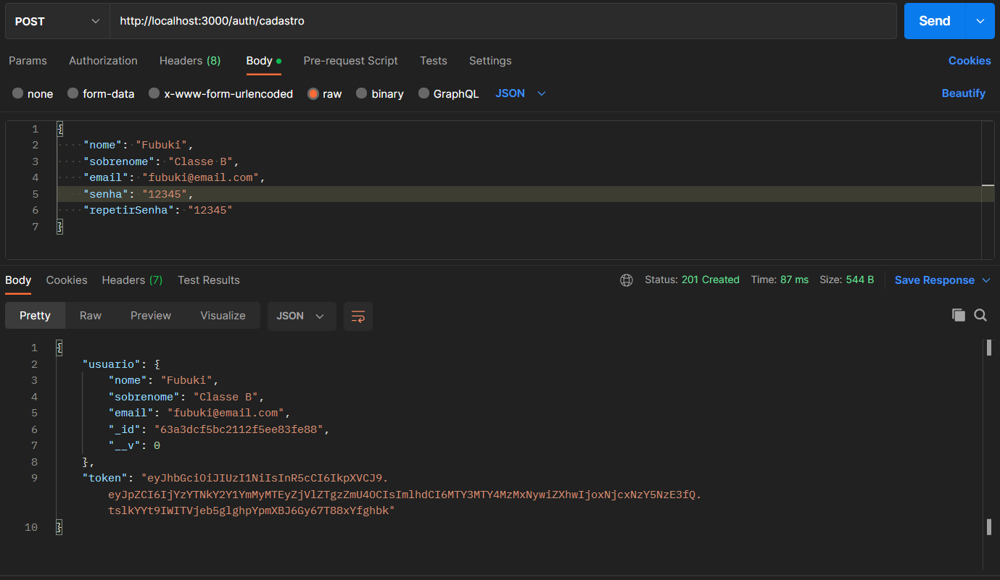
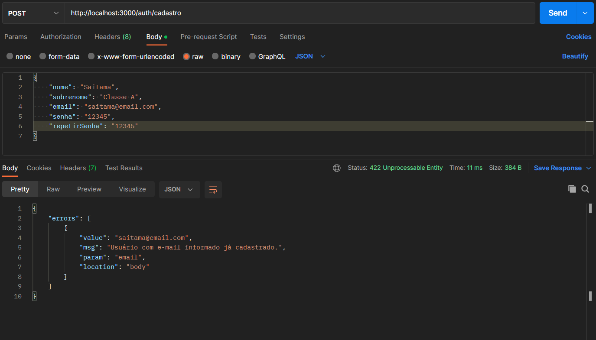
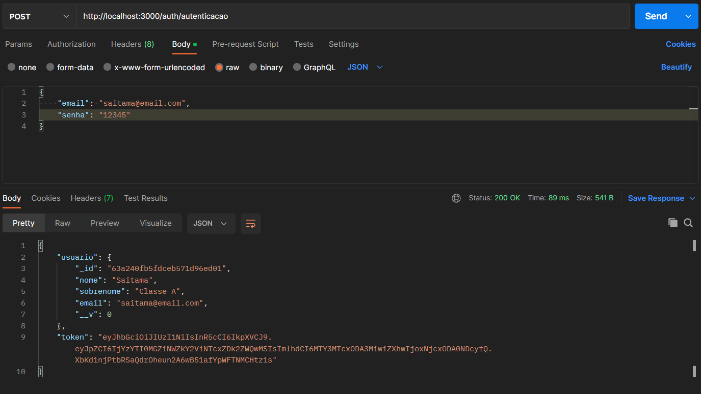
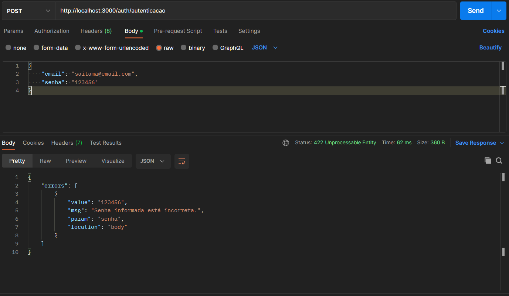

## 📋 Desenvolvimento API (backend):
- [ ] API REST com Express
- [ ] MongoDB com ODM Mongoose para operações (CRUD)
- [ ] CRUD com pradão REST e validação simples
- [ ] Endpoints com verbos HTTP
- [ ] Respostas em JSON com respectivos Status Code
- [ ] Testes de endpoints Postman

## 👶 Dependências: `npm install`
- `npm install express mongoose mongodb body-parser bcrypt dotenv express-validator jsonwebtoken cors`
- `npm install nodemon --save-dev`

## ⚙️ Configurações `.env`:
- DB_NAME: Nome do banco MongoDB na sua máquina
- DB_PORT: Número da porta do seu banco MongoDB da sua máquina
- SECRET: Cadeia de caracteres para criação do Token JWT de autenticação

## 🙆‍♂️ Testes HTTP:

<b>📒 Cadastro (POST)</b>

- **Success(201)**

- **Error(422)**

<b>🔐 Autenticação (POST)</b>

- **Success(200)**

- **Error(422)**

